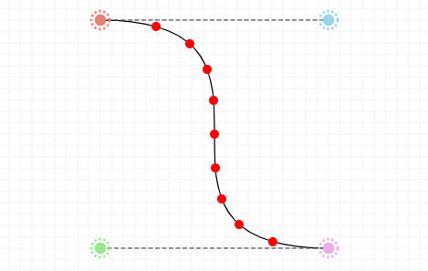

# JS Bezier curve

;

This is a bezier curve implementation in JavaScript.  
The curve is rendered with SVG, with the various and progress points positioned with JavaScript.

It is fully interactive, you can control the various control points and the curve will update itself accordingly.

